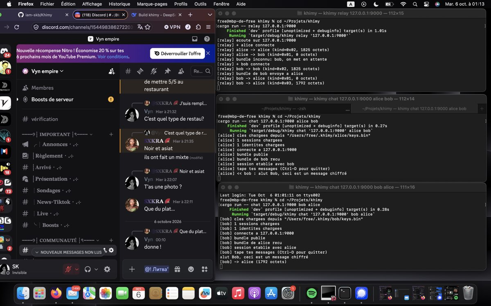

# Khimy

Chat chiffré de bout en bout (E2EE) en Rust, basé sur le protocole Signal.



## Ce que c'est

Khimy implémente un chat E2EE avec les mêmes primitives que Signal utilise en production :

- **X3DH** pour l'établissement de session
- **Double Ratchet** pour le forward secrecy
- **ML-KEM-1024** (post-quantique) via `libsignal-protocol`
- Un **relay TCP aveugle** qui ne voit que des octets opaques
- **Persistance des sessions** sur disque

Le ciphertext fait ~1792 octets pour un message de 40 caractères.

## Architecture

Alice et Bob échangent via un relay TCP qui ne peut pas lire les messages. Seuls les PreKeyBundle 
publics et les CiphertextMessage transitent sur le réseau.

## Installation

Prérequis : Rust, `protoc`.

```bash
git clone https://github.com/iam-skb/Khimy.git
cd Khimy
cargo build --release
